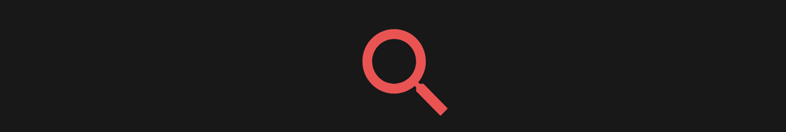

# コメントフィルター

## アプリケーション概要
コメントフィルターはYouTubeの指定した動画のコメントから日本語のコメントだけを表示するアプリケーションです。

<a href="http://52.199.147.88/" target="_blank">http://52.199.147.88/</a>

### サイトテーマ
海外で人気の動画における日本語のコメントを気軽に見ることができます。

### ターゲットユーザ
・YouTubeが好きな方
・海外で人気な動画をよく見る方

## 使用技術

- HTML/CSS
- Javascript
- Ruby 2.5.7
- Ruby on Rails 5.2.4.2
- MySQL 5.7
- AWS(EC2、RDS) Amazon Linux AMI 2018.03
- Docker 19.03.12
- docker-compose 1.27.2
- YouTube Data API

## 工夫した点

- 全て、<b>非同期通信</b>を使用し、ユーザーのストレスを軽減しました。
- <b>Docker</b>を使用し、簡単かつスピーディーな環境構築を可能にしました

## 主な機能
- URL指定による、日本語コメントの表示
- ソート機能 (評価順、新着順)

